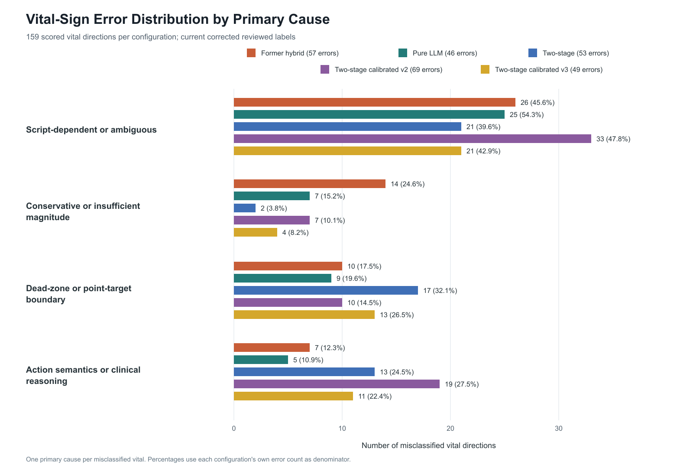

# Failure Report

**Evaluation unit:** individual vital-sign direction 
**Comparable observations:** 159 scored vital directions per configuration

## Executive Summary

This report compares vital-level direction errors from three selected LLM-based engine configurations:

- **Former hybrid:** `gpt-5`, 3-shot static
- **Pure LLM:** `gpt-5.5`, 3-shot `kind_hint` matched
- **Two-stage hybrid:** `gpt-5`, 3-shot static

| Vital-level result | Former hybrid | Pure LLM | Two-stage hybrid | Two-stage v2 | Two-stage v3 |
|---|---:|---:|---:|---:|---:|
| Correct directions | 102 | **113** | 106 | 90 | 110 |
| Incorrect directions | 57 | **46** | 53 | 69 | 49 |
| Vital-level direction accuracy | 64.15% | **71.07%** | 66.67% | 56.60% | 69.18% |

Pure LLM remains the best overall configuration. The two-stage hybrid improves over the former hybrid by four correct directions and is best on `no_action`, but it does not outperform pure LLM.

The new architecture changes the failure pattern. Decrease-to-stable errors fall from 26 in the former hybrid to 6 in the two-stage hybrid. However, stable-to-non-stable errors rise from 10 to 31. The dominant bias therefore changes from **too conservative** to **too willing to predict change**.

## 1. Method

The four cause categories are:

1. **Script-dependent or ambiguous:** the exact target branch, event, or timing is not uniquely selected by the allowed standalone input.
2. **Conservative or insufficient magnitude:** the prediction moves in the expected direction or remains unchanged, but the change is too small to reach the labeled direction.
3. **Dead-zone or point-target boundary:** the target or prediction lies near the categorical direction threshold, converting a plausible numeric difference into a direction mismatch.
4. **Action semantics or clinical reasoning:** the engine and label interpret the meaning or immediate physiological effect of an action differently. (vent, intubation)

Some observations could reasonably fit more than one category. The assignment represents the primary cause indicated by the target, prediction, allowed input, and model reasoning. 

## 2. Cause Distribution

| Primary cause | Former hybrid errors | Share of former errors | Pure errors | Share of pure errors | Two-stage errors | Share of two-stage errors | Two-stage v2 errors | Share of v2 errors | Two-stage v3 errors | Share of v3 errors |
|---|---:|---:|---:|---:|---:|---:|---:|---:|---:|---:|
| Script-dependent or ambiguous | 26 | 45.6% | 25 | **54.3%** | **21** | 39.6% | 33 | 47.8% | **21** | 42.9% |
| Conservative or insufficient magnitude | 14 | 24.6% | 7 | 15.2% | **2** | 3.8% | 7 | 10.1% | 4 | 8.2% |
| Dead-zone or point-target boundary | **10** | 17.5% | **9** | 19.6% | 17 | 32.1% | 10 | 14.5% | 13 | 26.5% |
| Action semantics or clinical reasoning | 7 | 12.3% | **5** | 10.9% | 13 | 24.5% | 19 | 27.5% | 11 | 22.4% |
| **Total errors** | **57** | **100.0%** | **46** | **100.0%** | **53** | **100.0%** | **69** | **100.0%** | **49** | **100.0%** |

The two-stage design nearly removes conservative or insufficient-change failures because Stage 1 explicitly fixes a non-stable direction and Stage 2 enforces a direction-crossing magnitude. The tradeoff is a substantial increase in boundary and action-interpretation errors.

## 3. Direction-Error Distribution

| Ground truth to prediction | Former hybrid | Pure LLM | Two-stage hybrid | Two-stage v2 | Two-stage v3 |
|---|---:|---:|---:|---:|---:|
| Decrease to stable | 26 | 20 | **6** | 39 | 15 |
| Increase to stable | 14 | 8 | **1** | 19 | 2 |
| Stable to increase | 7 | **6** | 16 | 10 | 15 |
| Stable to decrease | 3 | 4 | 15 | **1** | 9 |
| Decrease to increase | 5 | 6 | 8 | **0** | 3 |
| Increase to decrease | 2 | 2 | 7 | **0** | 5 |
| **Total** | **57** | **46** | **53** | **69** | **49** |

## 4. Errors by Vital Sign

| Vital | Support | Former errors | Former rate | Pure errors | Pure rate | Two-stage errors | Two-stage rate | Two-stage v2 errors | Two-stage v2 rate | Two-stage v3 errors | Two-stage v3 rate |
|---|---:|---:|---:|---:|---:|---:|---:|---:|---:|---:|---:|
| HR | 33 | 19 | 57.6% | 10 | 30.3% | 8 | 24.2% | 19 | 57.6% | **7** | **21.2%** |
| BP_sys | 37 | **6** | **16.2%** | **6** | **16.2%** | 11 | 29.7% | 15 | 40.5% | 10 | 27.0% |
| BP_dia | 35 | 14 | 40.0% | **11** | **31.4%** | 13 | 37.1% | 13 | 37.1% | 13 | 37.1% |
| RR | 22 | **10** | **45.5%** | 12 | 54.5% | 12 | 54.5% | **10** | **45.5%** | 11 | 50.0% |
| O2Sat | 30 | 8 | 26.7% | **7** | **23.3%** | 8 | 26.7% | 11 | 36.7% | **7** | **23.3%** |
| T | 2 | **0** | **0.0%** | **0** | **0.0%** | 1 | 50.0% | 1 | 50.0% | 1 | 50.0% |
| **Total** | **159** | **57** | **35.8%** | **46** | **28.9%** | **53** | **33.3%** | **69** | **43.4%** | **49** | **30.8%** |

The two-stage hybrid produces the best HR result, cutting errors from 19 to 8. It performs worse than the former hybrid on BP_sys and RR. Pure LLM remains strongest or tied on BP_sys, BP_dia, O2Sat, and T.

## 5. Cause Analysis

### 5.1 Script-Dependent or Ambiguous

This category contains 26 former-hybrid errors, 25 pure-LLM errors, and 21 two-stage errors. It remains the largest cause category for every configuration.

Representative vital-level failures include:

- `aortic_dissection:p2`: HR, BP, RR, and O2Sat targets select asystolic arrest. The two-stage engine recognizes some cardiovascular deterioration but still keeps RR and O2Sat stable.
- `subarachnoid_hemorrhage:p1`: BP and HR targets select rapid hypotension and reduced HR, while the engines infer a continued stress or Cushing response.

Changing the output architecture does not remove the input-identifiability problem. The two-stage mode lowers the count to 21, but many remaining failures still require knowing which scripted phase or complication occurs next.

### 5.2 Conservative or Insufficient Magnitude

Former hybrid has 14 under-scaled vital errors, pure LLM has 7, and the two-stage hybrid has only 2.

Examples include:

- Fluid treatment lowers HR too little in `adrenal_crisis:p1`, `adrenal_crisis:p2`, and `massive_upper_gi_bleed:p3`.
- Pacing raises BP_dia by only five points in `aortic_dissection:p6`.

The two remaining two-stage failures are HR after fluid treatment in `adrenal_crisis:p1` and `p2`. Stage 1 selects stable, so Stage 2 is not allowed to produce a direction-crossing magnitude.

The reduction from 14 to 2 confirms that explicit direction locking largely solves the old rule-anchor and insufficient-residual failure.

### 5.3 Dead-Zone or Point-Target Boundary

Former hybrid has 10 boundary errors, pure LLM has 9, and the two-stage hybrid has 17.

Examples include:

- `subarachnoid_hemorrhage:p4`: target O2Sat changes from 87 to 88 and is classified stable, while both engines predict a larger oxygen response.
- `severe_pediatric_asthma_exacerbation:p1`: target BP changes are at the five-point dead-zone boundary, while predictions cross into increase.

These errors are sensitive to the categorical threshold and exact point target. They increase in the two-stage engine because a selected increase or decrease is enforced with a minimum magnitude beyond the dead zone. A clinically plausible weak trend is therefore converted into a categorical error when the label remains stable.

### 5.4 Action Semantics or Clinical Reasoning

Former hybrid has 7 action-semantics errors, pure LLM has 5, and the two-stage hybrid has 13.

Examples include:

- `opioid_overdose_with_ards:p2`: target RR treats BVM as raising RR, while hybrid treats RR as intrinsic respiratory effort.
- `opioid_overdose_with_ards:p6`: target HR rises after intubation, while both engines leave opioid-related bradycardia stable.

The two-stage engine commits to these plausible clinical effects before seeing the rule estimate. This improves deterioration sensitivity but increases disagreement when the authored target assumes no immediate effect or a different action-timing convention.

### 5.5 Two-Stage Failure Mechanism Summary

The 53 two-stage direction errors arise primarily in Stage 1:

- **Overactive change prediction:** 31 stable observations are classified as increase or decrease.
- **Complete direction reversal:** 15 true increases or decreases are assigned the opposite direction.
- **Residual conservative behavior:** only 7 true non-stable observations are classified stable.

Once Stage 1 selects increase or decrease, the engine enforces a magnitude beyond the configured dead zone. This guarantees consistency between the selected and evaluated direction, but it also amplifies weak clinical tendencies into categorical changes. The 17 boundary errors are the clearest result of this mechanism.

## 6. Conclusions

1. **Pure LLM remains best overall.** It reaches 71.07% vital-level direction accuracy with 46 errors, compared with 66.67% and 53 errors for the two-stage hybrid.
2. **The two-stage hybrid improves over the former hybrid.** Accuracy rises from 64.15% to 66.67%, and `no_action` accuracy rises from 47.62% to 59.52%.
3. **Direction locking solves most conservative errors.** Decrease-to-stable falls from 26 to 6, increase-to-stable falls from 14 to 1, and under-scaled primary-cause errors fall from 14 to 2.
4. **The two-stage mode overcorrects toward change.** It makes 31 stable-to-non-stable errors, compared with 10 for both the former hybrid and pure LLM.
5. **Boundary and action-semantics errors increase.** The minimum direction-crossing magnitude contributes to 17 boundary errors, while early commitment to plausible action effects contributes to 13 action-semantics errors.
6. **Ambiguity remains an input limitation.** Script-dependent errors are 26, 25, and 21 for former hybrid, pure LLM, and two-stage hybrid respectively.
7. **HR benefits most from direction-first prediction.** HR errors fall from 19 in the former hybrid to 8 in the two-stage hybrid.
8. **Stage 1 requires stability calibration.** The next experiment should improve stable recall without restoring the original decrease-to-stable bias.
